<center><font face="Arial" size="6">Web Environment Setup & Implementation of Web Application</font>


<center>
    <font face="楷体" size="5">姓名：欧翌昕</font>
</center>

<center>
    <font face="楷体" size="5">专业：软件工程</font>
</center>

<center>
    <font face="楷体" size="5">学号：3190104783</font>
</center>
<center>
    <font face="楷体" size="5">课程名称：安全编程技术</font>
</center>

<center>
    <font face="楷体" size="5">指导老师：胡天磊</font>
</center>


<center>
    </font><font face="黑体" size="5">2020~2021春夏学期 2021 年 6 月 2 日</font>
</center>


# 1 Web Environment Setup

## 1.1 安装编辑器和浏览器

对于编辑器来说，每个人都有不同的偏好，可以自由选择。可以选择功能丰富的IDE（集成开发环境），比如 PyCharm；也可以选择相对轻量的编辑器，比如 Atom 或 Sublime Text。我选择的是Visual Studio Code (VSCode)。VSCode 是一个轻量级但功能强大的源代码编辑器，可在桌面上运行，适用于 Windows、macOS 和 Linux。 它内置了对 JavaScript、TypeScript 和 Node.js 的支持，并为其他语言（例如 C++、C#、Java、Python、PHP、Go）和运行时（例如 .NET 和 Unity）提供了丰富的扩展生态系统。

使用的浏览器是 Firefox。Firefox 是由 Mozilla 基金会及其子公司 Mozilla Corporation 开发的免费和开源网络浏览器。Firefox 使用 Gecko 布局引擎来呈现网页，该引擎实现了当前和预期的 Web 标准。

## 1.2 安装 Python

确保已经正确安装了 Python，执行下面的命令测试是否有报错：

```shell
python3 --version
```

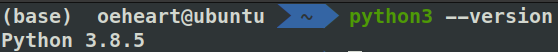

## 1.3 创建虚拟环境

虚拟环境是独立于 Python 全局环境的 Python 解释器环境，使用它的好处包括保持全局环境的干净、指定不同的依赖版本以及方便记录和管理依赖。我使用了 Anaconda 来管理虚拟环境。Anaconda 是用于科学计算（数据科学、机器学习应用程序、大规模数据处理、预测分析等）的 Python 和 R 编程语言的发行版，旨在简化包管理和部署。

使用下面的命令即可为当前项目创建一个虚拟环境：

```shell
conda create -n web python=3.8
```

创建虚拟环境后，可以使用下面的命令来激活虚拟环境：

```shell
conda activate web
```

这时命令提示符前会显示虚拟环境的名称，表示已经激活成功：


在激活虚拟环境后，无论操作系统和 Python 版本，都可以统一使用 `python` 和 `pip` 命令来调用当前虚拟环境内的 Python 和 pip 程序/二进制文件。

## 1.4 安装 Flask

Flask 是典型的微框架，作为 Web 框架来说，它仅保留了核心功能：请求响应处理和模板渲染。这两类功能分别由 Werkzeug（WSGI 工具库）完成和 Jinja（模板渲染库）完成。

激活虚拟环境后，使用下面的命令来安装 Flask：

```shell
pip install Flask
```

这会把 Flask 以及相关的一些依赖包安装到对应的虚拟环境。

编写一个简单的 Hello World 程序，查看 Flask 能否正常工作：

```python
from flask import Flask
app = Flask(__name__)

@app.route('/')
def hello():
    return 'Hello World!'

if (__name__ == '__main__'):
    app.run(host='127.0.0.1',port=5050)
```

运行结果如下图所示：

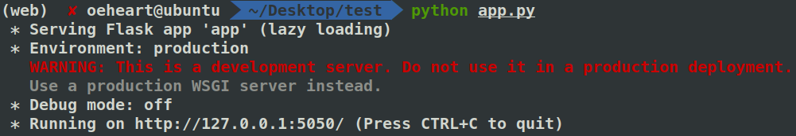

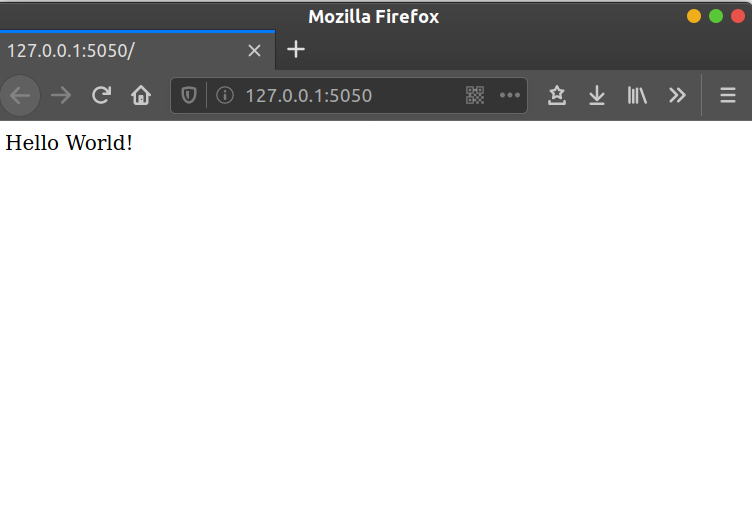

# 2 Implementation of Web Application

## 2.1 实验目的

1. 设计并实现一个精简的图书管理系统，具有入库、查询、借书、还书、借书证管理等基本功能
2. 通过本次设计来加深对 Web Applicat 工作原理的认识和理解 ，同时提高自身的 Web 编程能力

## 2.2 实验平台

- 操作系统：Ubuntu 20.04.2 LTS x86_64

- 开发工具：Python

- 前端框架：Bootstrap

  Bootstrap 是最受欢迎的 HTML、CSS 和 JS 框架，用于开发响应式布局、移动设备优先的 WEB 项目。

- 后端框架：Flask

  Flask 是一个用 Python 编写的微型 Web 框架。 它被归类为微框架，因为它不需要特定的工具或库。它没有数据库抽象层、表单验证或任何其他预先存在的第三方库提供通用功能的组件。但是，Flask 支持可以添加应用程序功能的扩展，就好像它们是在 Flask 本身中实现的一样。 存在对象关系映射器、表单验证、上传处理、各种开放身份验证技术和一些常见框架相关工具的扩展。

- 数据库平台：MySQL

  MySQL 是一个开源的关系数据库管理系统 (RDBMS)。 关系型数据库将数据组织成一个或多个数据表，其中数据类型可能相互关联； 这些关系有助于构建数据。 SQL 是程序员用来从关系数据库中创建、修改和提取数据以及控制用户对数据库的访问的语言。 除了关系数据库和 SQL 之外，像 MySQL 这样的 RDBMS 与操作系统一起工作，以在计算机的存储系统中实现关系数据库，管理用户，允许网络访问并促进测试数据库完整性和创建备份。

- 浏览器：Firefox、Chrome、Edge、Safari

实验主机配置如下：

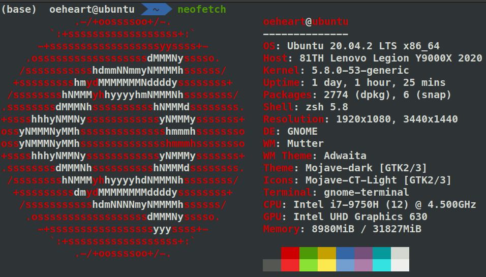

## 2.3 总体设计

### 2.3.1 系统架构

本系统主要包括管理员登录、图书入库、图书查询、借书管理、还书管理、借书证管理六大功能模块。各模块的功能描述如下：

|  模块名称  |                           功能描述                           |
| :--------: | :----------------------------------------------------------: |
| 管理员登录 |                 根据管理员 ID 和密码登录系统                 |
|  图书入库  | 1. 单本入库，直接从程序界面上输入<br/>2. 批量入库，从文本文件中批量导入图书数据 |
|  图书查询  | 1. 按书的类别，书名，出版社，年份，作者，价格进行查询<br/>2. 可以点击标题来对相应的字段进行排序 |
|    借书    | 1. 输入借书证卡号，自动显示该借书证所有已借书籍<br/>2. 输入书号，如果该书还有库存，则提示借书成功，同时库存数减一，否则输出该书无库存 |
|    还书    | 1. 输入借书证卡号，自动显示该借书证所有已借书籍<br/>2. 输入书号，如果该书在已借书籍列表内，则还书成功，同时库存数甲乙，否则输出出错信息 |
| 借书证管理 |                       增加或删除借书证                       |

系统处理基本流程如下：

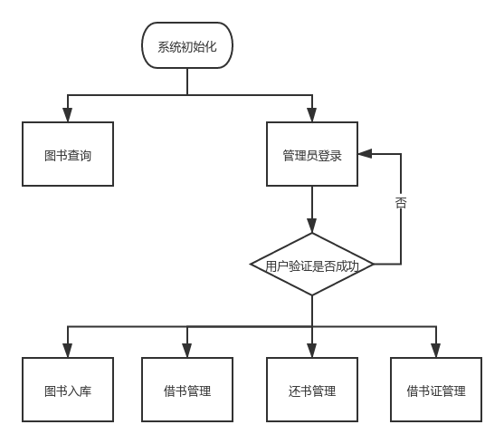

系统初始时仅有图书查询和管理员登录两个选项，图书查询为公共功能模块，不需要登录也可操作。管理员成功登录后，便可以选择进入图书入库、借书管理、还书管理、借书证管理功能。

### 2.3.2 数据库表结构设计

#### 2.3.2.1 图书信息表

|  字段名  |   数据类型   |    说明    |
| :------: | :----------: | :--------: |
|   BID    |   char(8)    | 书号(主键) |
| category |   char(10)   |    类别    |
|  title   | varchar(40)  |    书名    |
|  press   | varchar(20)  |   出版社   |
|   year   |     int      |  出版年份  |
|  author  | varchar(20)  |    作者    |
|  price   | decimal(7,2) |    价格    |
|  total   |     int      |  总藏书量  |
|  stock   |     int      | 目前库存量 |

创建图书信息表的 SQL 语句如下：

```sql
create table book(
	BID char(8) primary key,
	category char(10) not null,
	title varchar(40) not null,
	press varchar(30),
	year int,
	author varchar(20),
	price decimal(7,2),
	total int not null,
	stock int not null
)DEFAULT CHARACTER SET utf8 COLLATE utf8_general_ci;
```

#### 2.3.2.2 借书证表

|   字段名   |  数据类型   |    说明    |
| :--------: | :---------: | :--------: |
|    CID     | varchar(20) | 卡号(主键) |
|    name    | varchar(10) |    姓名    |
| department | varchar(40) |    单位    |
|    type    |   char(1)   | 持卡人类别 |

创建借书证表的 SQL 语句如下：

```sql
create table card(
	CID varchar(20) primary key,
	name varchar(10) not null,
	department varchar(40),
    type char(1) not null check(type in ('S','T'))
)DEFAULT CHARACTER SET utf8 COLLATE utf8_general_ci;
```

#### 2.3.2.3 管理员表

|  字段名  |  数据类型   |      说明       |
| :------: | :---------: | :-------------: |
|   AID    | varchar(20) | 管理员 ID(主键) |
| password | varchar(20) |      密码       |
|   name   | varchar(10) |      姓名       |
| contact  | varchar(20) |    联系方式     |

创建管理员表的 SQL 语句如下：

```sql
create table admin(
	AID varchar(20) primary key,
    password varchar(32) not null,
    name varchar(10) not null,
    contact varchar(20) not null
)DEFAULT CHARACTER SET utf8 COLLATE utf8_general_ci;
```

#### 2.3.2.4 借书记录表

|   字段名    |  数据类型   |       说明        |
| :---------: | :---------: | :---------------: |
|     RID     |  char(10)   |   流水号(主键)    |
|     CID     | varchar(20) |       卡号        |
|     BID     |   char(8)   |       书号        |
| borrow_date |    date     |     借书日期      |
| return_date |    date     |     还书日期      |
|     AID     | varchar(20) | 经手人(管理员 ID) |

创建借书记录表的 SQL 语句如下：

```sql
create table record(
	RID char(10) primary key,
    CID varchar(20) not null,
	BID char(8) not null,
	borrow_date date not null,
	return_date date,
    AID varchar(20) not null,
    foreign key (BID) references book(BID),
    foreign key (AID) references admin(AID)
)DEFAULT CHARACTER SET utf8 COLLATE utf8_general_ci;
```

## 2.4 详细设计

### 2.4.1 图书查询

图书查询界面如下图所示：


可以按书的类别、书名、出版社、年份、作者、价格进行查询。例如查询类别为“计算机”的所有图书，如果查询的图书存在则在界面右侧显示查询结果，如下图所示：

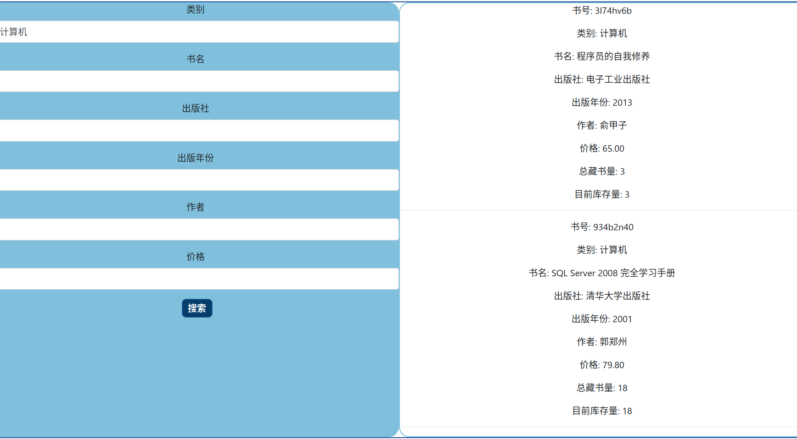

### 2.4.2 管理员登录

管理员界面如下图所示：


分别输入用户名和密码后点击登录按钮，加入输入的用户名或密码不正确，则会弹出错误提示，如下图所示：


输入正确的用户名或密码后即可登录，登陆成功后网站顶部导航栏将多出借书证管理、借阅/归还图书、图书管理、批量入库、管理员退出功能模块，如下图所示：


### 2.4.3 批量入库

批量入库界面如下图所示：


一个正常的导入文件内容如下图所示：

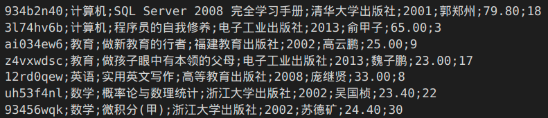

批量导入后可以进入 MySQL 检查数据是否插入成功，结果如下图所示：

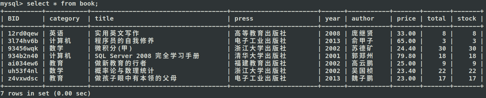

### 2.4.4 借书证管理

借书证管理界面如图所示：

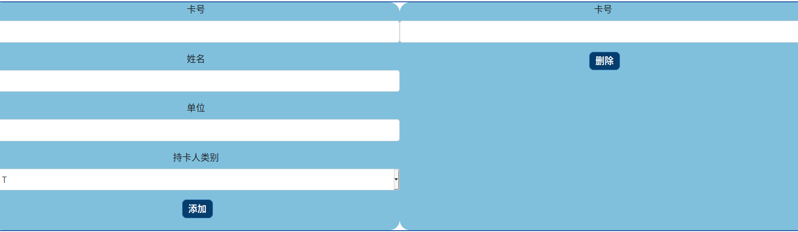

在左侧输入卡号、姓名、单位、持卡人类别(T 代表教师，S 代表学生)后点击添加按钮，若输入的卡号在数据库中不存在则可向数据库借书证表插入一条新数据，并提示添加成功，结果如下图所示：

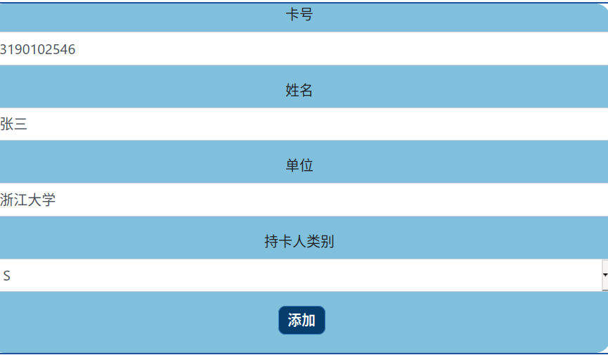


若输入的卡号在数据库中已经存在，则会提示错误信息，结果如下图所示：


在右侧输入卡号后点击删除按钮，若输入的卡号在数据库中存在且该卡号下不存在未归还的图书，即可将该借书证从借书证表中删除，并提示删除成功，结果如下图所示：


若输入的卡号在数据库中存在但该卡号下存在未归还的图书，则会提示错误信息，结果如下图所示：


若输入的卡号在数据库中不存在，则会提示错误信息，结果如下图所示：


### 2.4.5 借阅/归还图书

借阅/归还图书界面如下图所示：


在左侧输入卡号和书号信息，若输入的卡号和书号在数据库中均存在且该书仍有库存量，即可向借书记录表插入一条数据并提示借阅成功，结果如下图所示：


借阅成功后可以进入 MySQL 检查数据是否修改成功，结果如下图所示：

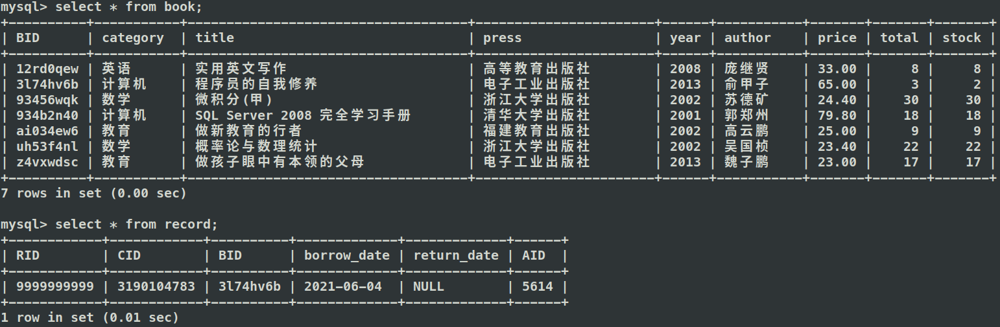

在右侧输入卡号和书号信息，若输入的卡号和书号在数据库中均存在，即可修改借书记录表中的归还时间信息并提示归还成功，结果如下图所示：


归还成功后可以进入 MySQL 检查数据是否修改成功，结果如下图所示：

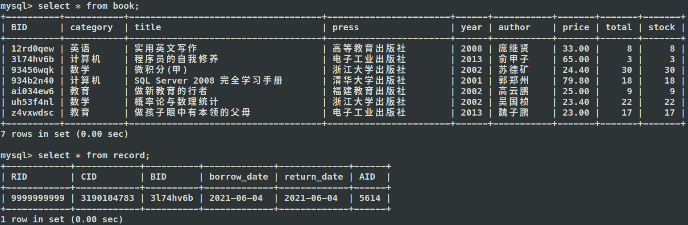

### 2.4.6 图书管理

图书管理界面如下图所示：

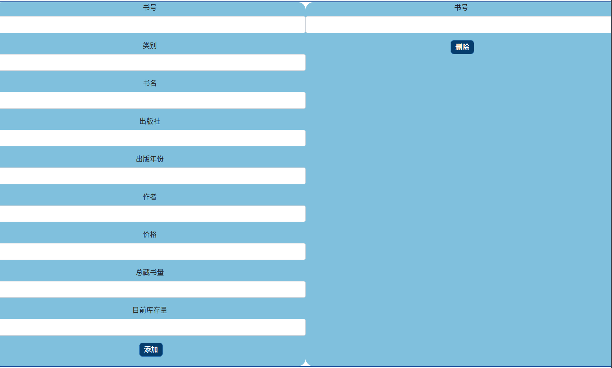

在左侧输入书号、类别、书名、出版社、出版年份、作者、价格、总藏书量、目前库存量信息后点击“添加”按钮，若输入的书号在数据库中不存在，即可向图书信息表中插入一条数据并提示添加成功信息，结果如下图所示：

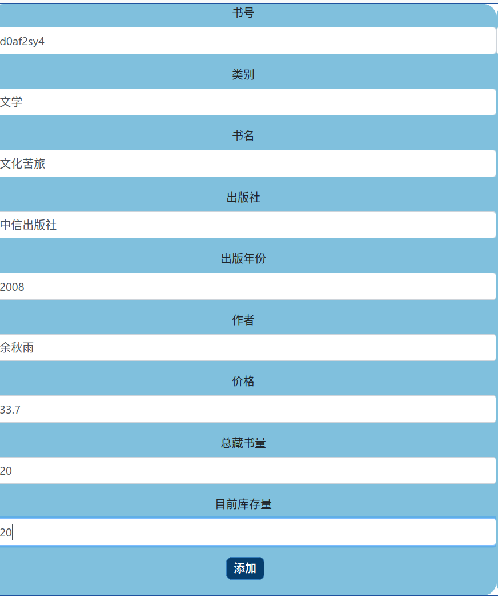


添加后可以进入 MySQL 检查数据是否插入成功，结果如下图所示：

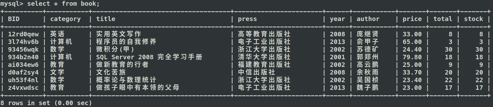

在右侧输入书号信息后点击删除按钮，若输入的书号在数据库中存在，即可从图书信息表中删除一条数据，并提示删除成功信息，结果如下图所示：


删除后可以进入 MySQL 检查数据是否插入成功，结果如下图所示：

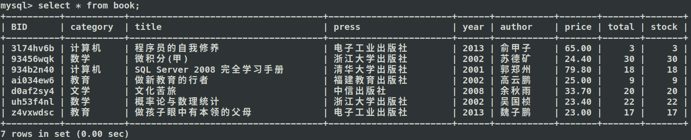

### 4.7 管理员退出

在顶部导航栏点击“管理员退出”后，系统恢复未登录状态，只有图书查询和管理员登录两个功能模块。
