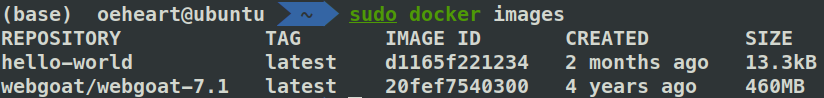

 


<center><font face="Arial" size="6">WebGoat Setup and Usag& Injection and XSS & Web Attack</font>


<center>
    <font face="楷体" size="5">姓名：欧翌昕</font>
</center>

<center>
    <font face="楷体" size="5">专业：软件工程</font>
</center>
<center>
    <font face="楷体" size="5">学号：3190104783</font>
</center>

<center>
    <font face="楷体" size="5">课程名称：安全编程技术</font>
</center>

<center>
    <font face="楷体" size="5">指导老师：胡天磊</font>
</center>


<center>
    </font><font face="黑体" size="5">2020~2021春夏学期 2020 年 5 月 26 日</font>
</center>

# 1 WebGoat Setup and Usage

### 1.1 WebGoat 安装

首先安装 Docker，本机实验环境如下：


在新主机上首次安装 Docker Engine 之前，需要设置 Docker 存储库。 之后可以从存储库安装和更新Docker。

更新 apt 软件包索引并安装软件包，以允许 apt 通过 HTTPS 使用存储库。

```shell
 sudo apt-get update

 sudo apt-get install \
    apt-transport-https \
    ca-certificates \
    curl \
    gnupg \
    lsb-release
```

添加 Docker 的官方 GPG 密钥。

```shell
curl -fsSL https://download.docker.com/linux/ubuntu/gpg | sudo gpg --dearmor -o /usr/share/keyrings/docker-archive-keyring.gpg
```

使用以下命令来设置稳定的存储库。

```shell
echo \
  "deb [arch=amd64 signed-by=/usr/share/keyrings/docker-archive-keyring.gpg] https://download.docker.com/linux/ubuntu \
  $(lsb_release -cs) stable" | sudo tee /etc/apt/sources.list.d/docker.list > /dev/null
```

更新apt软件包索引，并安装最新版本的Docker Engine和容器。

```shell
sudo apt-get update

sudo apt-get install docker-ce docker-ce-cli containerd.io
```

通过运行hello-world映像来验证Docker Engine是否已正确安装。


使用如下命令，下载 WebGoat-7.1 镜像：

```shell
sudo docker pull webgoat/webgoat-7.1
```

查看已下载镜像，观察到 WebGoat-7.1 已下载成功。



使用如下命令，启动容器运行 WebGoat：

```shell
sudo docker run -p 8080:8080 -t webgoat/webgoat-7.1
```

本机浏览器打开 http://127.0.0.1:8080/WebGoat/login 即可使用 WebGoat。

### 1.2 WebGoat使用


输入默认创建的用户名及密码即可登录。


---


# 2 Injection and XSS


---


# 3 Web Attack
