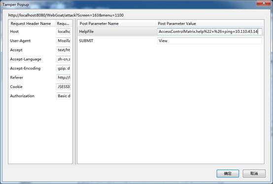
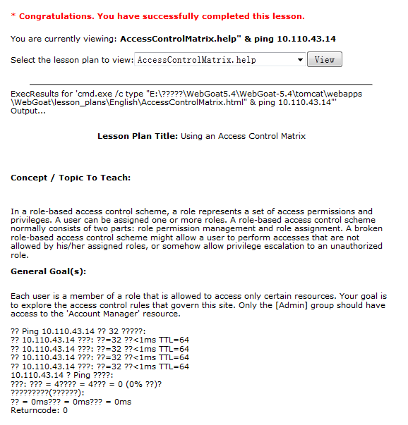

# Lab 1.3 WebGoat Setup & Usage

## Overview

WebGoat is a deliberately insecure J2EE web   application designed to teach web application security lessons. In each  lesson,  users must demonstrate their understanding of a security issue  by exploiting a  real vulnerability in the WebGoat application. For  example, the user must use  SQL injection to steal fake credit card  numbers. The application is a realistic  teaching environment, providing users with hints and code to further explain  the lesson.
 Back to the lab, we mainly have two work to  do in this lab:

1. Setup WebGoat .
2. Learn how to use WebGoat.

At the base of this lab, we can make  further exploration in lab1.4 about web attack.

## Steps

WebGoat support both the Windows and Linux  OS platform. You can choose either of it to do this lab.

### For Windows

1. Download the WebGoat from: http://code.google.com/p/webgoat/;
2. Unzip the file and Double click  webgoat.bat;
3. if you receive a bind address  error use, check the process that hold the port 80 or just Double click  webgoat8080.bat
4. After the script has start the  tomcat, Browse to http://localhost/WebGoat/attack or Browse to http://localhost:8080/WebGoat/attack.(webgoat:webgoat)
5. After that, you can start to  learn to use WebGoat.

### For Linux

1. Download the WebGoat from: http://code.google.com/p/webgoat/;
2. Unzip the file and run sudu  ./webgoat.sh start80
3. If you receive a bind address  or privilege error, you should  check out the process that hold the port of 80, kill  the found process  and rerun the sudn ./webgoat.sh start80 or just run sudu ./webgoat.sh   start8080
4. After the script has start the  tomcat, Browse to http://localhost/WebGoat/attack or Browse to http://localhost:8080/WebGoat/attack.(webgoat:webgoat);
5. After that, you can start to  learn to use WebGoat.
6. You can shut down the server  with:./webgoat.sh stop.

## Deliverables

In lab1.3, you don’t have to write a single  lab report, but submit  the report together with lab1.4 (see details of lab 1.4 for deadline).  In the part of lab1.3,  you should record the procedure how you setup  the WebGoat and also questions you  have come across together with your  solution. 
  To show what have you done, I think some  screen shots are necessary in your lab report.

 The contents of WebGoat 8.0+ are inconsistent to our requirements. Please install your WebGoat to version <= 7, such  as WebGoat 5.4/7.1. In practice, the newest JDK may have some problems,  we recommend JDK 1.7/1.8.

---

# Lab 1.4 Injection & XSS

## Overview

In this Lab, you are going to do the  Injection and  XSS attack in the WebGoat which you have setup and learned to use  in  lab1.3. Before you start, FireBox browser and some of its plugin such as  Tamper Data are recommended to help with your attack.   Back to the lab, what we going to do in  this lab:                                  

1. Injection Attack.

   All kinds of injections in the WebGoat are required  to be  done. When you have finish a special attack, the WebGoat will  check it. 

2. XSS Attack.

   All kinds of XSS in the WebGoat are required to be done.  When you have finish a special attack, the WebGoat will check it. 

## Steps 

In Lab1.3, we have setup the WebGoat, and  known how to use the  WebGoat. To finish labl.4, we will login the WebGoat and  do the  Injection Attack and XSS Attack. 

1. Visit the WebGoat page: http://localhost:8080/WebGoat/attack;  
2. Select the Injection Flaw in  the left and start to do the Injection attack;  
3. Each of the attack has a  solution, if you have no idea what to do, you can refer to the solution to help finish your work.  
4. Select the Cross-Site Scripting (XSS) in  the left and start to do the XSS attack.   

## Examples 

**Hint**: The newest version of FireFox may not support Temper Data anymore. Hence, we also recommend to use [OWASP ZAP](https://www.zaproxy.org/) and any other web browsers to finish this experiment. Or you can choose a lower version of FireFox (Firefox52.8.1 esr 64 bit seems to work). 

**Injection-Command Injection**  

1. Start the Tamper Data plugin in  the firefox, and “Start Tamper”;  

2. Click “Viewer” to send request  which can be caught by Tamper;  

3. To do Command Injection, we may  add a ping command or other  command in the end of the url, which will be  execute, for example: ping your local address “ping 10.110.43.14”;  

4. But the command should be  encoded to url, so encode the string "  & ping 10.110.43.14, which turn out to be  %22+%26+ping+10.110.43.14 in  UrlEncode;  

5. Copy the Encoded string at the  end of HelpFile url, like below: 

   

6. Click the OK button to send the  request. The page return with “Congratulations” like below.

   

## Deliverables

You will have to write and submit the lab  report together with  lab1.3. In the part of lab1.4, you should record the  procedure how you  proceed every Injection and XSS attack. 

To show what you have done, I think some  screen shots are necessary in your lab report.

The lab report should be a pdf document named  with “**SP2021-LAB1.3&1.4-ID-NAME**”. As usual, send it to TA([liuyuchen0921@zju.edu.cn](mailto:liuyuchen0921@zju.edu.cn)) before **2021.6.6 23:59:59**. You will get ZERO if late for 1 second.

---

# Lab 1.5 Web Attack

## **Overview**

Before we start lab1.5, we have to claim  that this  is an optional lab, which means that you don’t have to do this lab if   your time is not allowed. But if you have time and interest to finish  this lab  and submit a single lab report, you may get 5 points bonus!
So, back to the lab, what we going to do in  this lab:  Choose two kinds of Web attack in the WebGoat and finish all the   related attack items. That’s it!

## Steps

Just like lab1.4, to finish labl.5, we will  login the WebGoat and do the web attack what you have chosen.

1. Visit the WebGoat page: http://localhost:8080/WebGoat/attack;
2. Select two web attack types you  are interesting and try to finish every items of them in the WebGoat.
3. Each of the attack has a  solution, if you have no idea what to do, you can refer to the solution to help finish your work.

## Deliverables

If you choose to do this lab to get bonus, you  will have to  descripts which two web attack type you have chosen and the  procedure  how you finish all the attack items in the former lab report “**SP2021-LAB1.3&1.4-ID-NAME**” and change the name to “**SP2021-LAB1.3&1.4&1.5-ID-NAME**”. You need just send it to TA ([liuyuchen0921@zju.edu.cn](mailto:liuyuchen0921@zju.edu.cn)) before **2021.6.6 23:59:59**. To show what you have done, I think some screen shots are necessary in your  lab report.