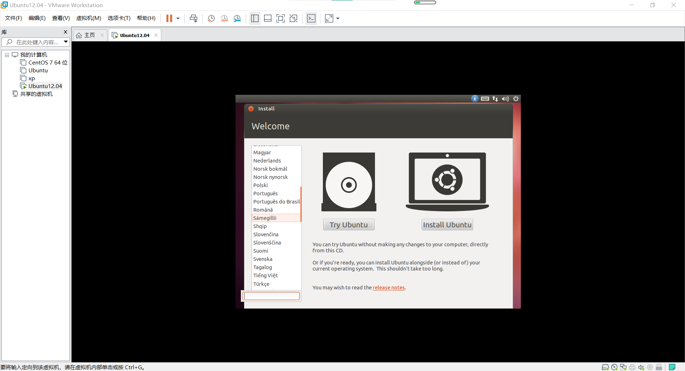
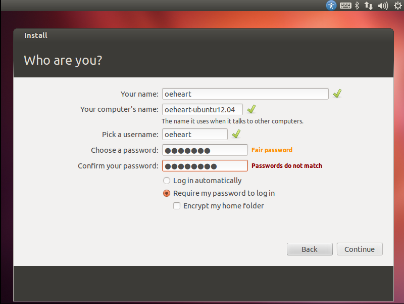

<center><font face="Arial" size="6">Setting up Ubuntu Linux with VMWare Player</font>


<center>
    <font face="楷体" size="5">姓名：欧翌昕</font>
</center>

<center>
    <font face="楷体" size="5">专业：软件工程</font>
</center>

<center>
    <font face="楷体" size="5">学号：3190104783</font>
</center>
<center>
    <font face="楷体" size="5">课程名称：安全编程技术</font>
</center>

<center>
    <font face="楷体" size="5">指导老师：胡天磊</font>
</center>


<center>
    </font><font face="黑体" size="5">2020~2021春夏学期 2021 年 6 月 6 日</font>
</center>


# 1 实验目的要求

1. 掌握虚拟机的安装与使用
2. 掌握基本的 Ubuntu 的安装与使用
3. 掌握文本编辑器 Vi 的使用

# 2 实验内容和步骤

1. 下载并安装 VMWare Workstation Pro
2. 下载 Ubuntu12.04 安装包文件
3. 使用 VMWare Workstation Pro 安装 Ubuntu 虚拟机
4. 使用 Vi 文本编辑器编辑文本

# 3 实验结果

## 3.1 安装 VMWare Workstation Pro

下载虚拟机软件，这里使用的是 Windows 操作系统下的 VMware Workstation 15.5 Pro。安装成功后界面如下：


## 3.2 安装 Ubuntu 虚拟机

从 http://old-releases.ubuntu.com/releases/precise/ 下载 ubuntu-12.04-desktop-i386.iso 映像文件。

主页点击创建新的虚拟机，选择典型（推荐），点击下一步。


此处选择稍后安装操作系统，点击下一步。


客户机操作系统选择 Linux，版本选择 Ubuntu，点击下一步。


虚拟机名称设置为 Ubuntu12.04，选择虚拟机存放路径，点击下一步。


最大磁盘大小大小选择20GB，选择将虚拟磁盘存储为单个文件以提高虚拟机的磁盘性能，点击下一步。


点击自定义硬件，对虚拟机进行一些细微的配置。


内存设为4GB，处理器数量设为2，每个处理器的内核数量选择2，网络适配器选择NAT模式。


在新CD/DVD(IDE)中选择使用ISO映像文件，选择已经下载好的 ubuntu-12.04-desktop-i386.iso 映像文件，关闭后点击完成。


开启此虚拟机进入安装页面，选择 Install Ubuntu。



选择手动配置分区分区，选择新挂载点使用的分区方案为标准分区，交换分区划分4GB，启动分区划分200MB，剩余空间全部划分给根分区。


选择时区和默认安装语言，设置用户名、主机名和用户密码



等待安装完成。


安装并启动成功。


## 3.3 使用 Vi 文本编辑器

通过输入以下命令，使用 Vi 创建一个文件：

```
vi hello.txt
```


敲击键盘“i”键进入插入模式，并输入字符串“Hello world!”。


敲击键盘“Esc”键返回命令模式，并输入“:wq”保存并退出。


查看文件内容，确认修改并保存成功。

