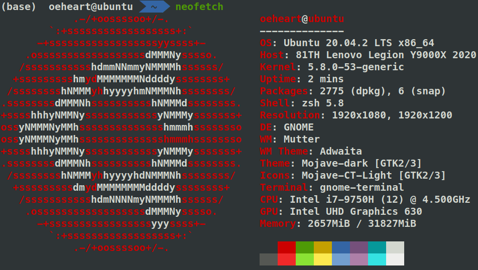
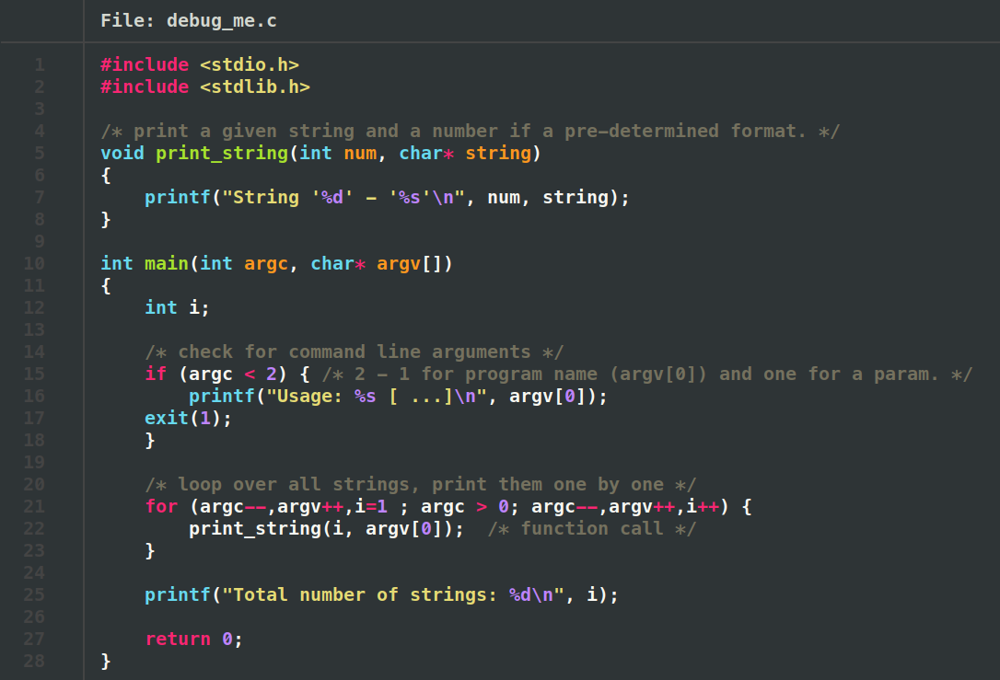
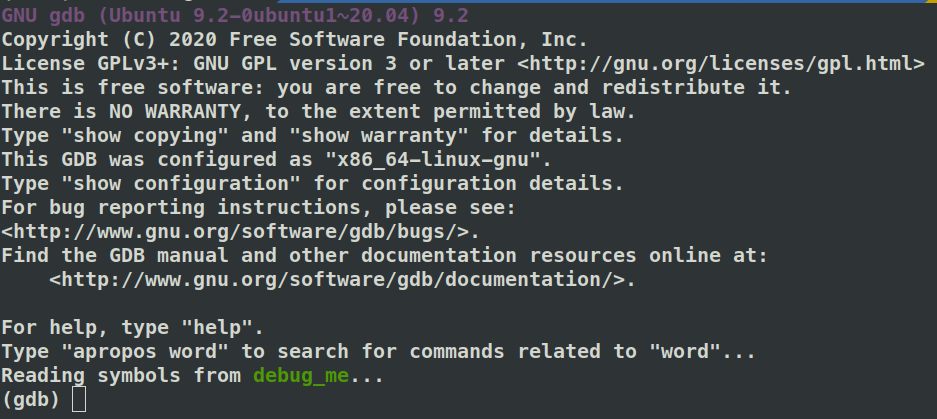
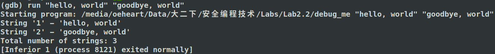
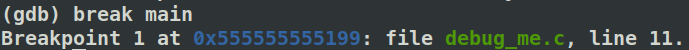
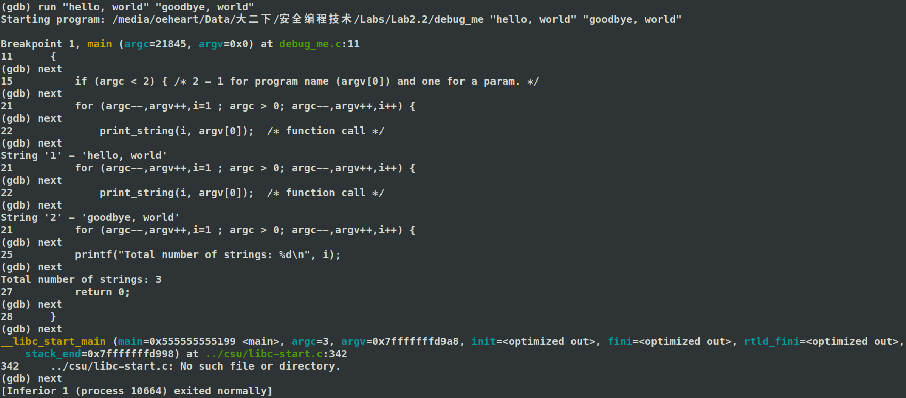
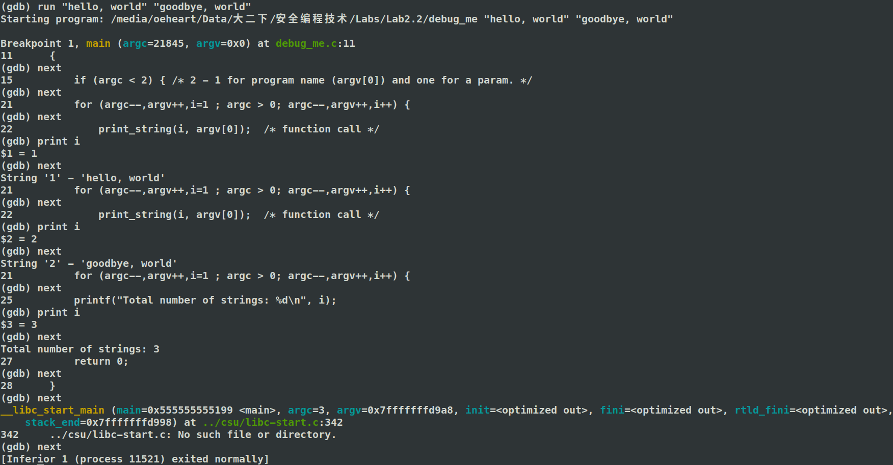
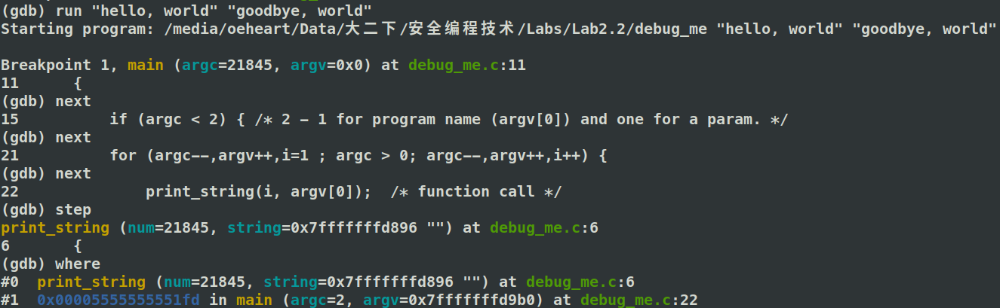
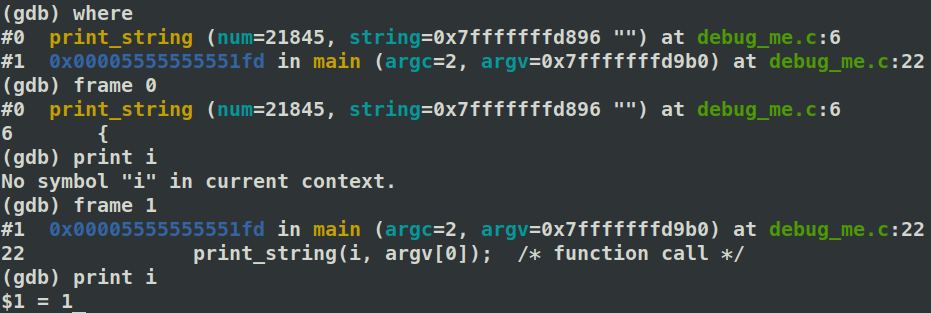

<center><font face="Arial" size="6">Running a Hello World Program in C using GCC</font>


<center>
    <font face="楷体" size="5">姓名：欧翌昕</font>
</center>

<center>
    <font face="楷体" size="5">专业：软件工程</font>
</center>

<center>
    <font face="楷体" size="5">学号：3190104783</font>
</center>
<center>
    <font face="楷体" size="5">课程名称：安全编程技术</font>
</center>

<center>
    <font face="楷体" size="5">指导老师：胡天磊</font>
</center>


<center>
    </font><font face="黑体" size="5">2020~2021春夏学期 2021 年 6 月 6 日</font>
</center>


# 1 实验目的要求

1. 掌握使用 gcc 运行程序
2. 掌握使用 gdb 调试程序

# 2 实验平台



# 3 实验内容与步骤

打开 Ubuntu 的 Terminal，创建 debug_me.c 文件，文件内容如下：



调用 gdb 调试 debug_me.c，使用终端命令如下：

```
gcc -g debug_me.c -o debug_me
gdb debug_me
```

命令成功执行后结果如下图所示：



在 gdb 中运行程序，使用的命令如下：

```
run "hello, world" "goodbye, world"
```

结果如下图所示：



通过指定一个函数名称的方式设置断点，在每次调用该函数时中断，使用的命令如下：

```
break main
```

结果如下图所示：



设置断点后，可以单步运行程序，可以使用 next 和 step 两种方式进行单步运行，主要区别在于当 next 遇到函数调用时将其视为一个语句来执行，而 step 遇到函数调用时会进入函数内部并一步步执行，单步运行结果如下图所示：



在单步运行程序时，可以使用命令输出一个变量的内容，结果如下图所示：



单步运行程序到断点，检查函数调用堆栈，使用的命令如下：

```
where
```

函数调用堆栈结果如下图所示：



可以看到当前正在执行的函数 print_string 和调用它的函数 main ，然后使用以下命令来查看区别：

```
frame 0
print i
frame 1
print i
```

结果如下图所示：


