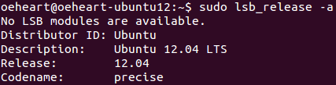
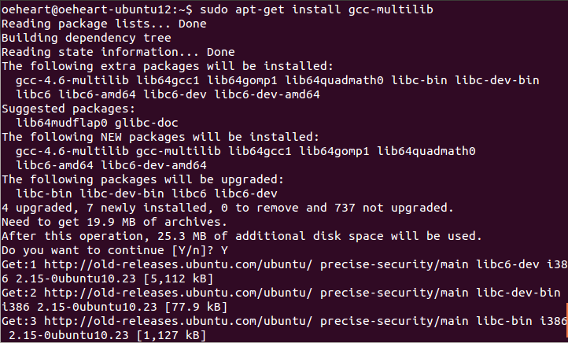
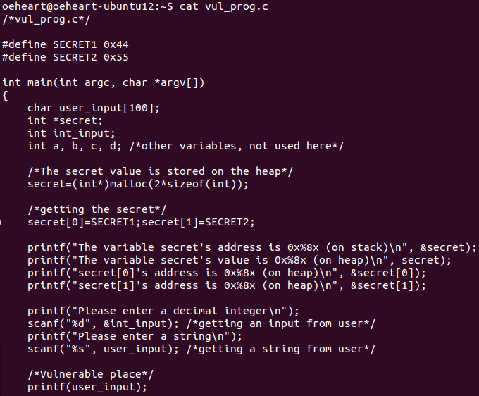
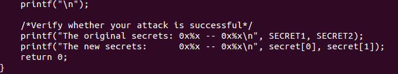
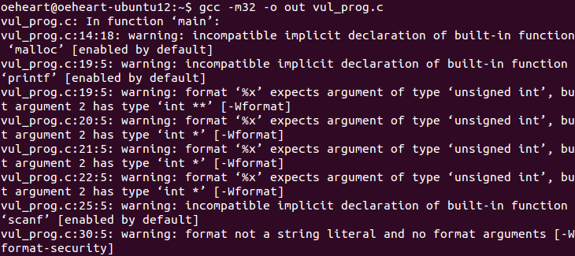
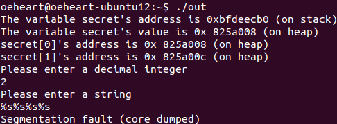
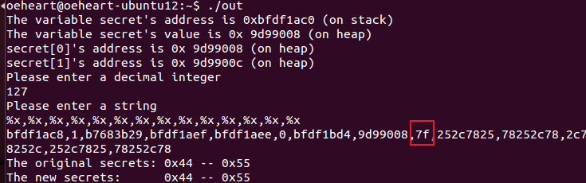
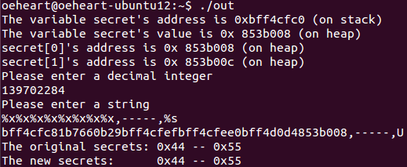
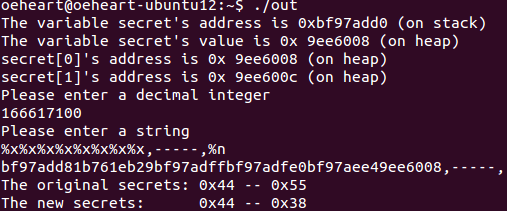
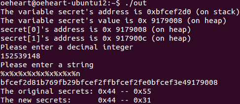

<center><font face="Arial" size="6">Format String Vulnerability</font>


<center>
    <font face="楷体" size="5">姓名：欧翌昕</font>
</center>
<center>
    <font face="楷体" size="5">专业：软件工程</font>
</center>

<center>
    <font face="楷体" size="5">学号：3190104783</font>
</center>

<center>
    <font face="楷体" size="5">课程名称：安全编程技术</font>
</center>

<center>
    <font face="楷体" size="5">指导老师：胡天磊</font>
</center>


<center>
    </font><font face="黑体" size="5">2020~2021春夏学期 2021 年 7 月 3 日</font>
</center>


# 1 实验目的

本实验的学习目标是将在课堂上学到的关于漏洞的知识付诸行动，获得有关格式字符串漏洞的第一手经验。 format-string 漏洞是由 printf(用户输入) 等代码引起的，其中用户输入的变量内容由用户提供。 当此程序以特权运行时（例如 Set-UID 程序），此 printf 语句变得危险，因为它可能导致以下后果之一：(1) 程序崩溃，(2) 从任意内存位置读取， (3) 修改任意内存位置中的值。 最后一个后果是非常危险的，因为它可以允许用户修改特权程序的内部变量，从而改变程序的行为。

在本实验中，我们将获得一个带有格式字符串漏洞的程序；任务是制定一个利用漏洞的方案。

# 2 实验平台



# 3 实验内容与步骤

本次实验采用32位 Ubuntu 使用的传参方式对源代码进行编译。

首先在 `\etc\apt\sources.list` 中修改镜像源配置为：

```
deb http://old-releases.ubuntu.com/ubuntu/ precise main restricted universe multiverse
deb http://old-releases.ubuntu.com/ubuntu/ precise-security main restricted universe
multiverse
deb http://old-releases.ubuntu.com/ubuntu/ precise-updates main restricted universe
multiverse
deb http://old-releases.ubuntu.com/ubuntu/ precise-proposed main restricted universe
multiverse
deb http://old-releases.ubuntu.com/ubuntu/ precise-backports main restricted universe
multiverse
```

然后安装安装32位的编译方式和必要的组件，结果如下图所示：



创建以下内容的 C 文件：





为了方便实验，使用32位编译器对程序进行编译产生 out 文件，使用的命令如下：

```shell
$gcc -m -o out vul_prog.c
```

结果如下图所示：



暂时忽略编译过程中的 warning 报错。

通过 malloc 函数生成的 `secret[0]` 和 `secret[1]` 被存放在堆中，用户需要输入的数字和 string，以及指向 `secret` 的指针被存放在栈中，printf 函数在处理的时候需要先将参数从右到左压入堆栈，然后遍历格式化的字符串，每次碰到 `%` 的格式化输出就需要从栈中弹出一个元素来与之对应，如果用户输入的带 `%` 的格式化输出参数的个数大于世纪传入的参数，就会出现内存泄漏的问题。

## 3.1 Crash the program named "vul_prog.c"

输入一堆带 `%s` 的格式字符串，使程序不断地进行出栈操作，从而产生崩溃，结果如下图所示：



## 3.2 Print out the secret[1] value

观察发现 `int_input` 在 `user_input` 之后被定义，因此它在栈中的地址应低于 `user_input`，因此可以利用这个变量来进行攻击。

运行程序后首先输入一个数字，这里输入了127，然后不断地通过 `%x` 来进行弹栈，观察 127 被放在了哪里，结果如下图所示：



观察发现 127 在第九个参数。因此可以把输入 `secret[1]` 的地址作为 `int_input` 输入 %x%x%x%x%x%x%x%x,-----,%s 来弹出前八个字
符串，然后通过 `%s` 来读取 `int_input` 指向的 `secret[1]` 的值，结果如下图所示：



观察发现读到了字符 U。

## 3.3 Modify the secret[1] value

输入格式字符串 %x%x%x%x%x%x%x%x,-----,%n，其中 `%n` 能将当前已经输出的字符的个数赋值给传入的参数，结果如下图所示：



观察发现 0x38 被写到了 `secret[1]` 的地址中。

## 3.4 Modify the secret[1] value to a pre-determined value

假设想把 0x31 写到 `secret[1]` 的地址中，只需要在输入的格式字符串中删掉长度为7的 `,-----,` 那部分，结果如下图所示：



观察发现 0x31 被写到了 `secret[1]` 的地址中。
