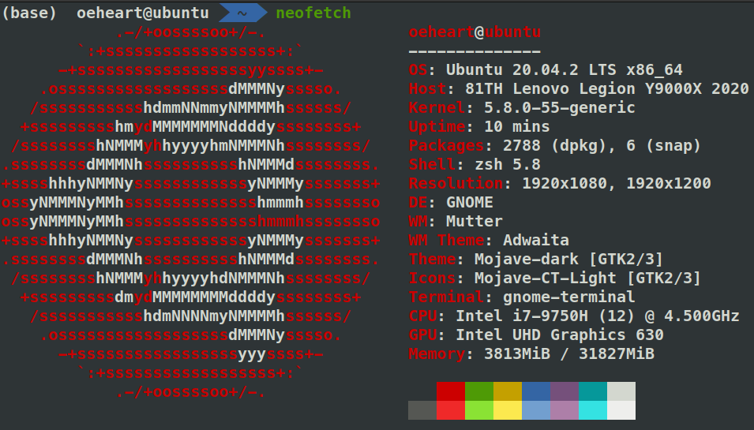
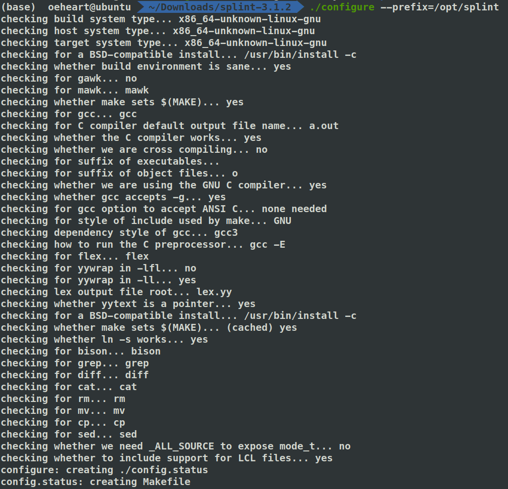
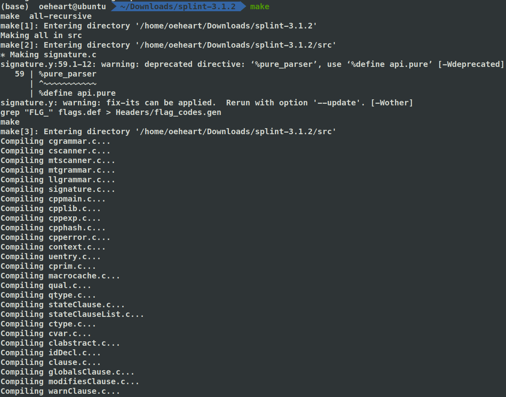
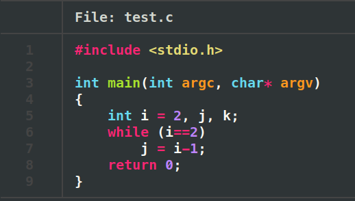
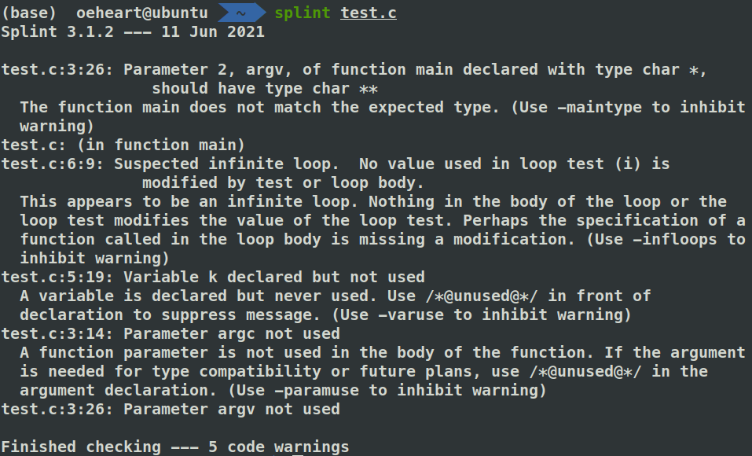
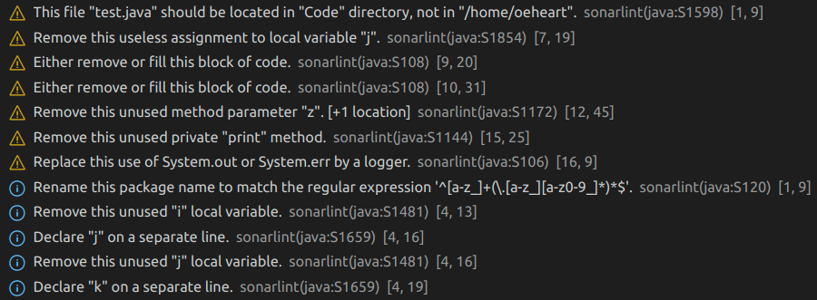

<center><font face="Arial" size="6">Using splint for C static analysis & Using vscode for java static analysis</font>


<center>
    <font face="楷体" size="5">姓名：欧翌昕</font>
</center>

<center>
    <font face="楷体" size="5">专业：软件工程</font>
</center>
<center>
    <font face="楷体" size="5">学号：3190104783</font>
</center>

<center>
    <font face="楷体" size="5">课程名称：安全编程技术</font>
</center>
<center>
    <font face="楷体" size="5">指导老师：胡天磊</font>
</center>


<center>
    </font><font face="黑体" size="5">2020~2021春夏学期 2021 年 6 月 11 日</font>
</center>


# 1 实验目的

1. 学习使用静态代码分析工具检查 c 程序是否存在安全漏洞和编码错误
2. 学习在 VSCode 中使用静态代码分析器检查 Java 程序是否存在安全漏洞和编码错误

# 2 实验平台



# 3 实验内容与步骤

## 3.1 安装 splint

[Splint](http://splint.org/) 是一种静态检查 C 程序安全漏洞和编程错误的工具。 Splint 执行许多传统的 lint 检查，包括未使用的声明、类型不一致、定义前使用、无法访问的代码、忽略的返回值、没有返回的执行路径、可能的无限循环和失败案例。

下载 [splint-3.1.2](http://www.splint.org/downloads/splint-3.1.2.src.tgz) 并使用如下命令解压：

```shell
$tar zxvf splint-3.1.2.src.tgz
```

在制定目录中安装 Splint 二进制文件和库，使用的命令如下：

```shell
$sudo mkdir /opt/splint
$./configure --prefix=/opt/splint
$make
```

结果如下图所示：





设置环境变量，添加路径如下：

```shell
export LARCH_PATH=/opt/splint/share/splint/lib
export LCLIMPORTDIR=/opt/splint/share/splint/imports
export PATH=$PATH:/opt/splint/bin
```

## 3.2 使用 splint 检测 c 程序

准备一段存在安全漏洞的 c 语言程序如下：

```c
#include <stdio.h>

int main(int argc, char* argv) 
{
    int i = 2, j, k;
	while (i==2)
		j = i-1;
	return 0;
}
```



使用 splint 对该 c 语言程序进行检测，结果如下图所示：



可以看出 splint 检测出了五处错误，分别是：

1. 命令行参数类型设置错误
2. 死循环
3. 主函数内部变量经生命但未使用
4. 命令行参数 argc 未使用
5. 命令行参数 argv 未使用

## 3.3 安装 SonarLint

在 VS Code 中安装 [SonarLint](https://www.sonarlint.org/vscode) 插件，SonarLint 是一个免费的 IDE 扩展，可让我们在编码问题出现之前进行修复。就像拼写检查器一样，SonarLint 在我们编写代码时会突出显示错误和安全漏洞，并提供明确的补救指导，以便我们可以在代码提交之前修复它们。 VS Code 中的 SonarLint 支持对 JavaScript、TypeScript、Python、Java、HTML 和 PHP 代码的分析。


## 3.4 使用 SonarLint 检测 Java 程序

准备一段存在安全漏洞的 Java 语言程序如下：

```java
package Code;
public class Analysis {
    public static void main(String[] args) {
        int i, j, k = 2;
        try {
            while (k == 2) {
                j = k-1;
            }
            if (1) { }
        } catch (Exception e) { }
    }
    public static int max(int x, int y, int z) { 
        return x > y ? x : y;
    }
    private static void print() {
        System.out.println("unused private method");
    }
}
```

使用 SonarLint 对该 Java 语言程序进行检测，结果如下图所示：



可以看出 SonarLint 检测出了多种错误，分别是：

1. 函数形参未使用
2. 局部变量经声明但未使用
3. 空白 if body
4. 空白 catch body
5. 私有方法 `print` 未使用

但 SonarLint 插件未发现程序的死循环问题，依然有待完善。
